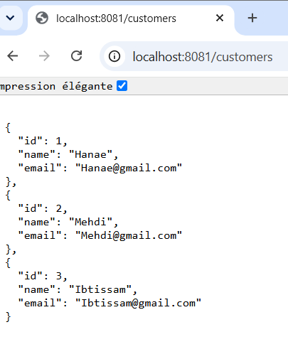
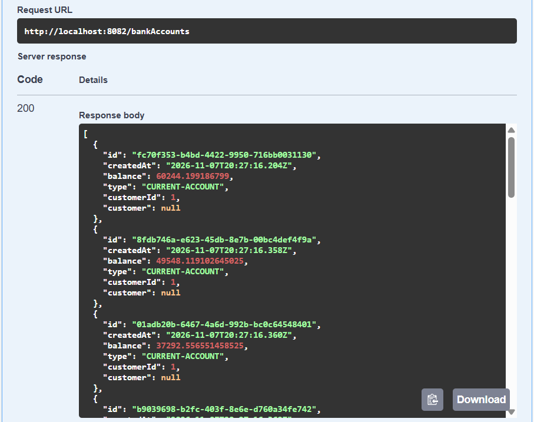
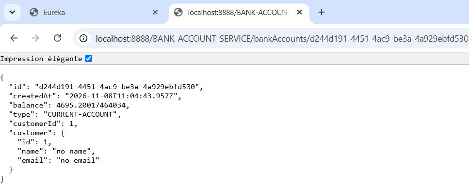
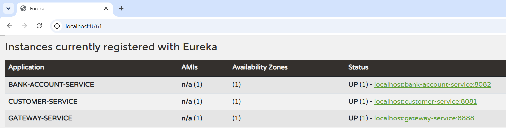
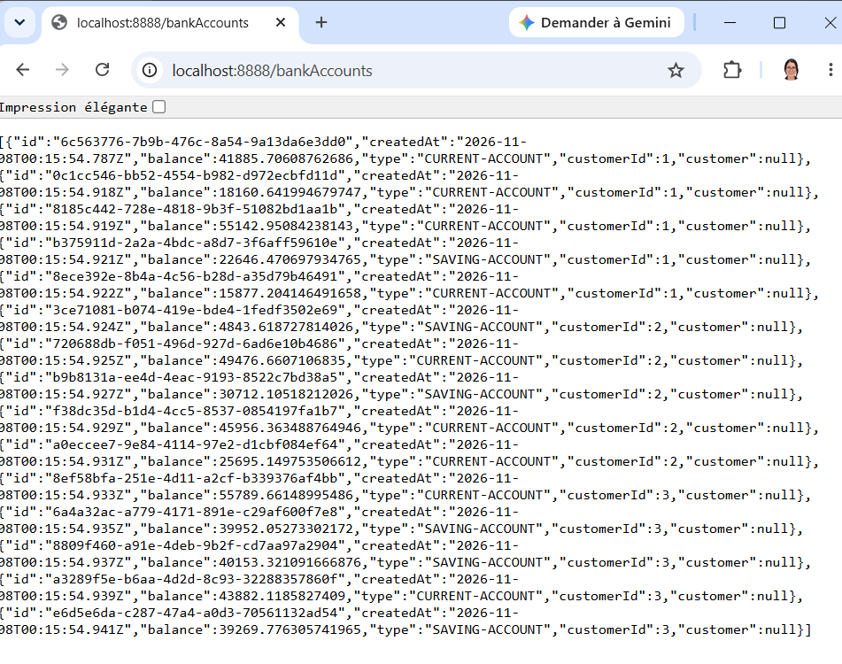
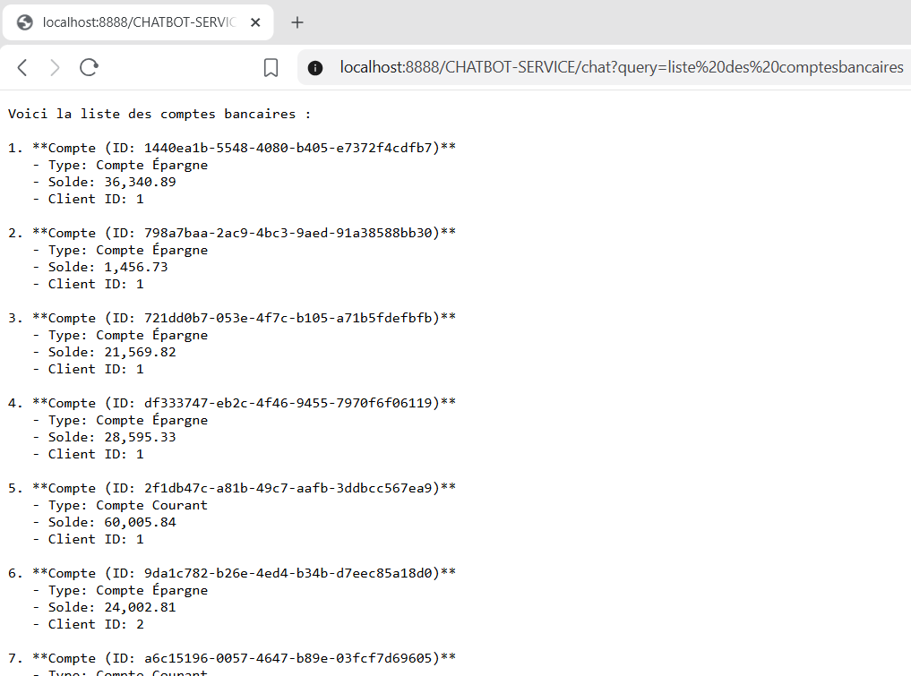
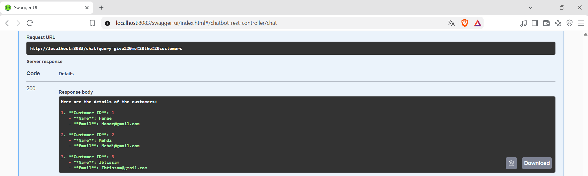
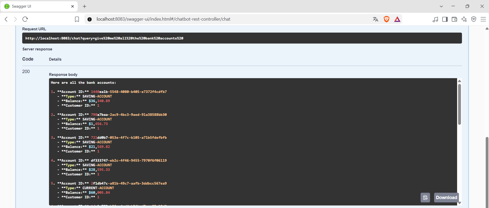
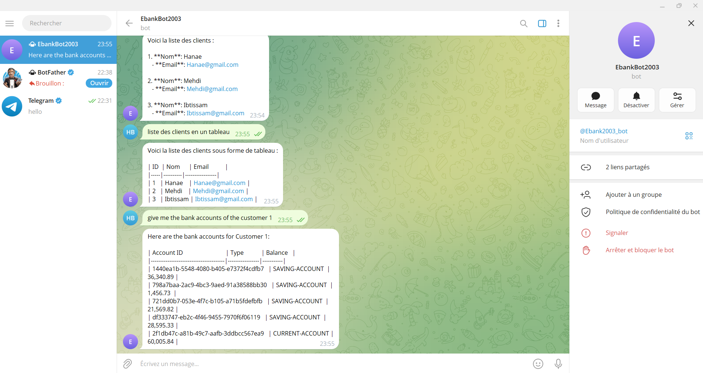

# Projet JEE : Architecture micro-services avec un chatbot IA

Application bancaire basée sur une **architecture micro-services** (Spring Boot et Spring Cloud), complétée par un **chatbot intelligent** (Spring AI et MCP) accessible en REST, sur Telegram et sur Discord.

Réalisé par **Hanae Bouichnad**, dans le cadre du module JEE.

---

## Architecture

```
        Telegram / Discord / Postman / Navigateur
                          |
                          v
              +-----------------------+
              |   GATEWAY-SERVICE     |  :8888   point d'entrée unique
              +-----------------------+
                 |        |         |
                 v        v         v
   +--------------+  +------------------+  +-----------------+
   | CUSTOMER-    |  | BANK-ACCOUNT-    |  | CHATBOT-        |
   | SERVICE      |<-| SERVICE          |  | SERVICE         |
   | :8081        |  | :8082            |  | :8083           |
   | clients      |  | comptes          |  | agent IA        |
   | MCP Server   |  | OpenFeign +      |  | (Spring AI,     |
   |              |  | Circuit Breaker  |  |  OpenAI GPT-4o) |
   |              |  | MCP Server       |  | MCP Client      |
   +--------------+  +------------------+  +-----------------+
          ^                   ^                 |       |
          |       MCP         |       MCP       |       |
          +-------------------+-----------------+       |
          |                   |                         |
          +---------+---------+-------------------------+
                    |   inscription des services
                    v
          +------------------------+
          |  DISCOVERY-SERVICE     |  :8761   annuaire Eureka
          +------------------------+
```

| Service | Port | Rôle |
|---|---|---|
| **discovery-service** | 8761 | Annuaire Eureka : chaque service s'y inscrit avec son nom |
| **gateway-service** | 8888 | Point d'entrée unique, routage statique et dynamique |
| **customer-service** | 8081 | Gestion des clients (CRUD), expose ses fonctionnalités en outils MCP |
| **bank-account-service** | 8082 | Gestion des comptes (CRUD), appelle customer-service via OpenFeign, Circuit Breaker Resilience4J, outils MCP |
| **chatbot-service** | 8083 | Agent IA (Spring AI + GPT-4o) avec mémoire, client MCP, bots Telegram et Discord |

---

## Technologies

- **Java 17**, **Spring Boot 4**, **Spring Cloud**
- **Spring Web**, **Spring Data JPA**, **H2**, **Lombok**
- **Eureka** (Discovery Service), **Spring Cloud Gateway**
- **OpenFeign** (communication entre services), **Resilience4J** (Circuit Breaker)
- **Spring AI** avec **OpenAI GPT-4o**, **MCP** (Model Context Protocol)
- **Telegram Bots**, **Discord** (JDA)
- **Springdoc OpenAPI** (Swagger UI)

---

## Organisation de chaque micro-service

Chaque service métier suit une architecture en couches :

```
controllers   -> endpoints REST
services      -> logique métier (+ outils MCP avec @McpTool)
repositories  -> accès aux données (Spring Data JPA)
entities      -> tables de la base H2
dtos          -> données échangées avec le client (Request / Response)
mappers       -> conversion Entité <-> DTO
feign         -> client OpenFeign (bank-account-service)
model         -> objet Customer reçu de customer-service (bank-account-service)
```

---

## 1. Customer-Service

Tous les clients :

<a href="screenShots/customerScreens/1-showCustomers.png"></a>

Un client par son id :

<a href="screenShots/customerScreens/2-showCustomer.png"></a>

---

## 2. Bank-Account-Service

Tous les comptes (Swagger UI) :

<a href="screenShots/bankAccountScreens/1-showBankAccounts.png"></a>

Un compte par son id :

<a href="screenShots/bankAccountScreens/2-showBankAccount.png"></a>

### Communication entre services avec OpenFeign

Bank-Account-Service appelle Customer-Service pour récupérer les informations du propriétaire du compte :

<a href="screenShots/bankAccountScreens/3-openFeign.png"></a>

### Circuit Breaker (Resilience4J)

Quand Customer-Service est arrêté, Bank-Account-Service ne plante pas : la méthode de secours (fallback) renvoie un client par défaut.

<a href="screenShots/bankAccountScreens/4-resilience4j.png"></a>

---

## 3. Discovery Service (Eureka)

Les services inscrits dans l'annuaire :

<a href="screenShots/discoveryScreens/1-eureka.png"></a>

---

## 4. Gateway

**Routage statique** (routes définies dans `application.yml`) :

<a href="screenShots/gatewayScreens/1-gatewayCustomers.png"></a>

<a href="screenShots/gatewayScreens/2-gatewayBankAccounts.png"></a>

**Routage dynamique** (routes générées à partir d'Eureka, avec le nom du service dans l'URL) :

<a href="screenShots/gatewayScreens/3-gatewayChatbot.png"></a>

---

## 5. Chatbot IA (Spring AI + MCP)

Les micro-services exposent leurs fonctionnalités comme **outils MCP** (`@McpTool`). Le chatbot les découvre et **GPT-4o choisit lui-même** l'outil à appeler selon la question.

Question générale (sans outil) :

<a href="screenShots/chatbotScreens/1-chatbot.png"></a>

Mémoire de la conversation :

<a href="screenShots/chatbotScreens/2-chatbotMemoire.png"></a>

Liste des clients :

<a href="screenShots/chatbotScreens/3-chatbotCustomers.png"></a>

Un client :

<a href="screenShots/chatbotScreens/4-chatbotCustomerId.png"></a>

Tous les comptes :

<a href="screenShots/chatbotScreens/5-chatbotBankAccounts.png"></a>

Détails d'un compte, avec son propriétaire :

<a href="screenShots/chatbotScreens/6-chatbotBankAccountId.png"></a>

Comptes d'un client sous forme de tableau :

<a href="screenShots/chatbotScreens/7-chatbotCustomerBankAccounts.png"></a>

### Bot Telegram

<a href="screenShots/chatbotScreens/8-chatbotTelegram.png"></a>

### Bot Discord

<a href="screenShots/chatbotScreens/9-chatbotDiscord.png"></a>

---

## Lancer le projet

### Variables d'environnement

Les clés ne sont pas dans le code. Avant de lancer `chatbot-service`, définir :

| Variable | Description |
|---|---|
| `OPENAI_API_KEY` | clé de l'API OpenAI |
| `TELEGRAM_BOT_TOKEN` | token du bot Telegram (BotFather) |
| `DISCORD_TOKEN` | token du bot Discord |

### Ordre de démarrage

1. `discovery-service`
2. `customer-service`
3. `bank-account-service`
4. `gateway-service`
5. `chatbot-service` (en dernier : il se connecte aux serveurs MCP au démarrage)

### URLs utiles

| URL | Description |
|---|---|
| http://localhost:8761 | Tableau de bord Eureka |
| http://localhost:8888/customers | Clients via la Gateway |
| http://localhost:8888/bankAccounts | Comptes via la Gateway |
| http://localhost:8083/chat?query=... | Chatbot |
| http://localhost:8083/swagger-ui.html | Swagger du chatbot |